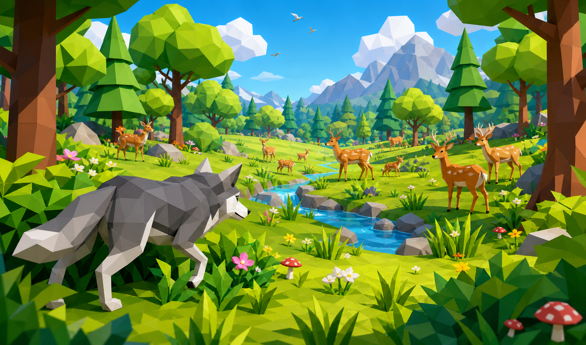
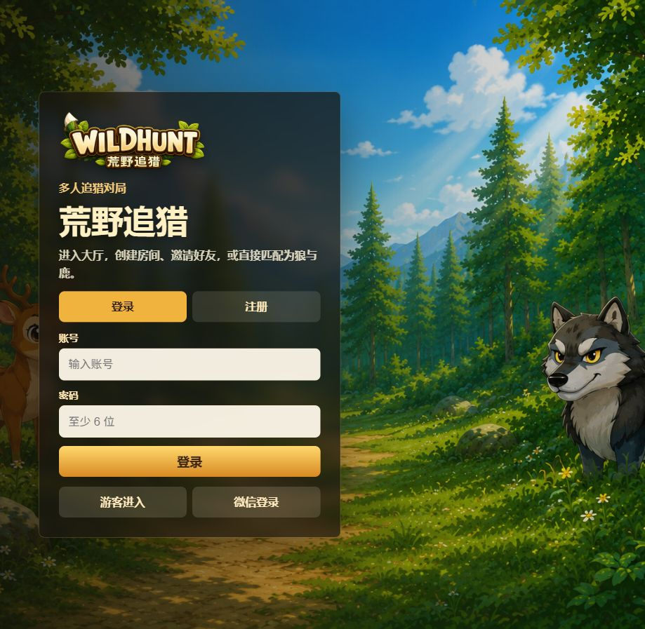
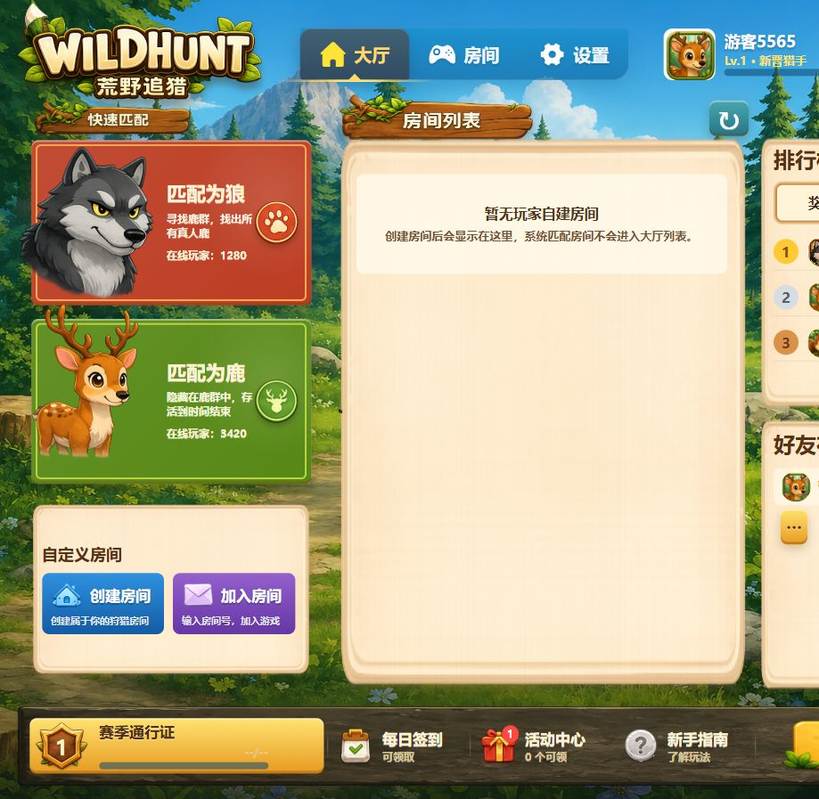
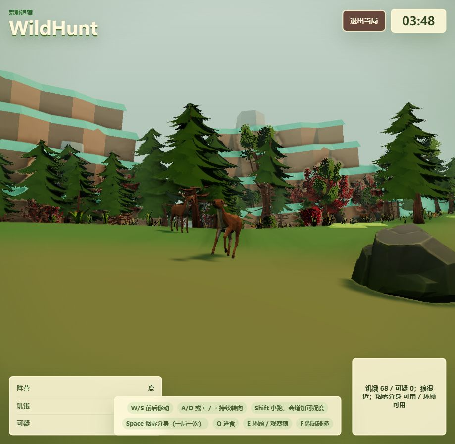
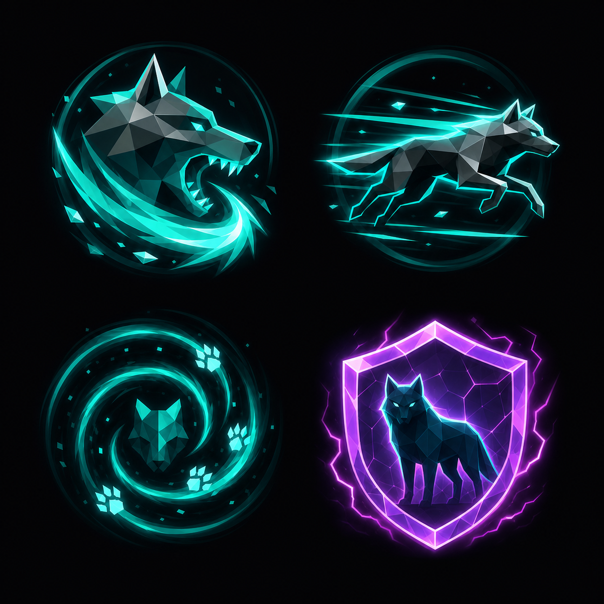
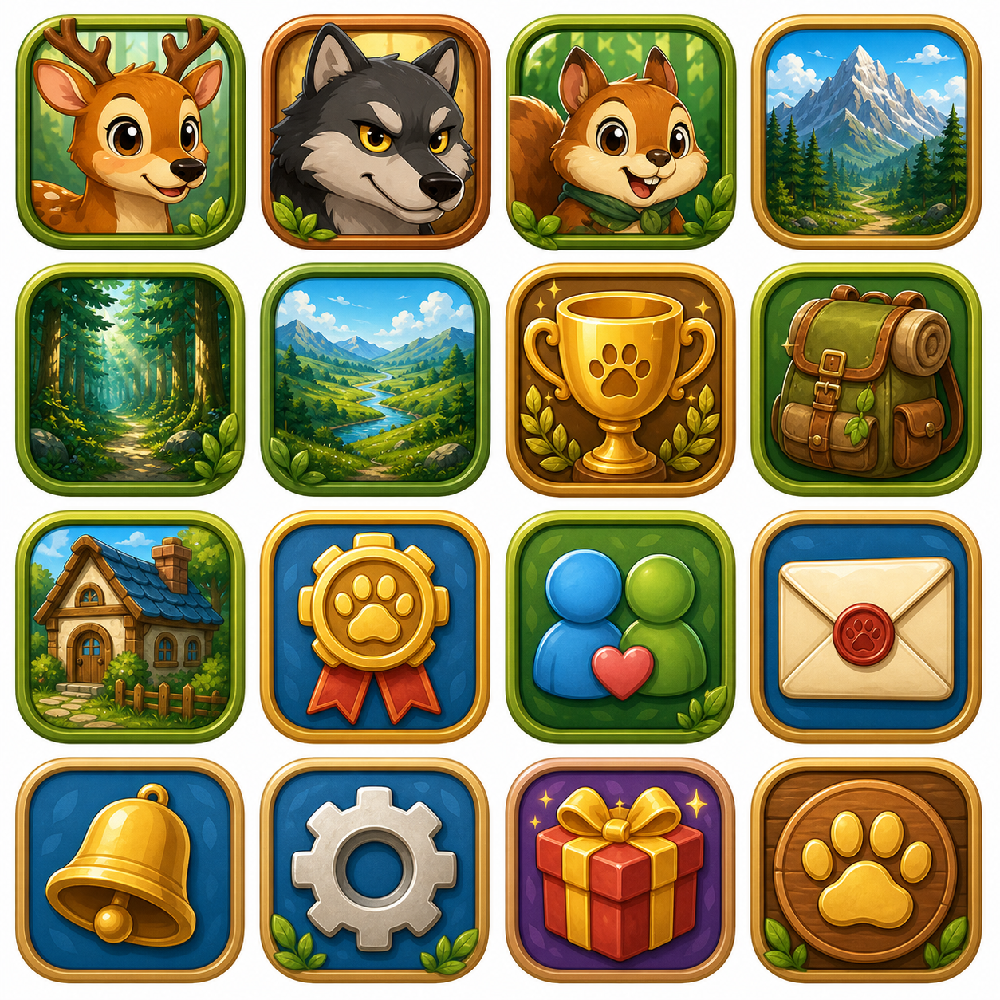
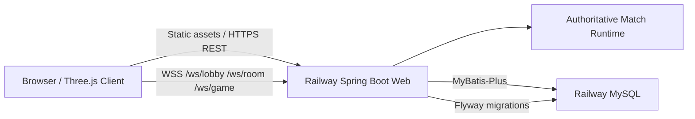
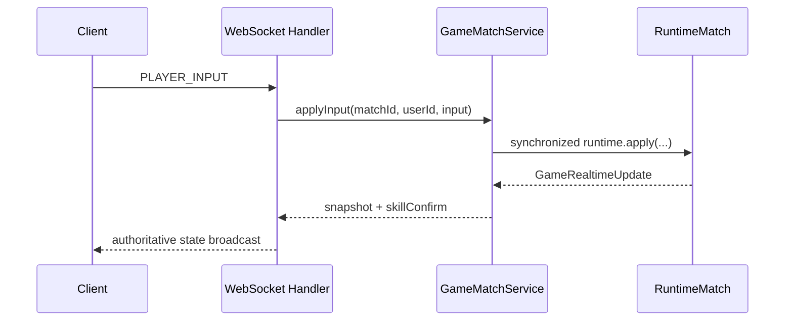

<p align="right">
  <a href="./README.md">中文</a> | <strong>English</strong>
</p>

# WildHunt

A web-based multiplayer asymmetric hunting game: wolves must identify and catch real deer within a limited time, while deer blend into an AI herd, manage their state, observe threats, and use a one-time smoke decoy skill to mislead the hunters.



## Online Demo

- Recommended entry: <https://wildhunt-backend-production.up.railway.app>
- API docs: <https://wildhunt-backend-production.up.railway.app/swagger-ui.html>
- China repository (Gitee): <https://gitee.com/susantyp/wildhunt-fullstack>
- International repository (GitHub): <https://github.com/typsusan-zzz/wildhunt-fullstack>

> The current online environment runs on free Railway resources, so cold starts, database access, and multiplayer sync may be slow. For the best experience, clone the repository and run it locally.

## Screenshots

| Login | Lobby | Match |
| --- | --- | --- |
|  |  |  |

## Gameplay Overview

WildHunt is built around disguise, observation, judgment, and counterplay.

- Wolf objective: find all real deer before the countdown ends. Wolves can move, track scent, and pounce, but hitting AI deer or decoys wastes opportunities.
- Deer objective: blend into the herd and survive until time runs out. Deer can eat to maintain hunger, look around to estimate the wolf's position, and use a smoke decoy at a critical moment.
- Smoke decoy: each deer can use it once per match. The skill is confirmed by the backend, then creates smoke and two server-synced deer decoys at the cast location. Decoys are not players, do not count toward victory conditions, and disappear when hit by a wolf.
- Matchmaking and rooms: supports guest login, account login, custom rooms, room chat, friend invites, quick matchmaking, and active match recovery.
- Progression: includes season pass, daily check-in, activity rewards, leaderboard, and player profile systems.





## Technical Architecture





## Frontend Architecture

- Vite + TypeScript builds the browser client.
- Three.js powers the 3D scene, deer herd, wolf, terrain, natural objects, and smoke VFX.
- The input layer separates movement, sprinting, and one-shot actions. One-shot actions use sequence numbers so WebSocket messages are sent at least once.
- The network layer uses REST for login, rooms, matchmaking, rewards, and related business flows, and WebSocket for authoritative match snapshots.
- Production builds can be served from the Spring Boot backend under the same domain, or hosted separately when needed.

Key directories:

```text
frontend/src/api/       REST API client
frontend/src/net/       WebSocket client and protocol types
frontend/src/game/      3D game scene, input, network sync, VFX
frontend/public/        Public static assets
```

## Backend Architecture

- Spring Boot 3 + Java 17 provides REST APIs and WebSocket services.
- `wildhunt-web`: controllers, WebSocket handlers, CORS configuration, and application entry point.
- `wildhunt-service`: domain logic for users, friends, rooms, matchmaking, matches, rewards, check-ins, activities, and more.
- `wildhunt-dal`: MyBatis-Plus entities, mappers, and database access.
- `wildhunt-common`: shared API responses, utilities, and models.
- MySQL schema is managed with Flyway migrations. Some services keep in-memory fallbacks for local development and tests when MySQL is unavailable.

Key directories:

```text
backend/wildhunt-web/
backend/wildhunt-service/
backend/wildhunt-dal/
backend/wildhunt-common/
backend/wildhunt-web/src/main/resources/db/migration/
backend/docs/init_sql/wildhunt.sql
```

## Local Development

Requirements:

- Node.js 22+
- JDK 17
- Maven 3.9+
- MySQL 8+

The initialization script is located at `backend/docs/init_sql/wildhunt.sql`. Import it if you want to quickly restore a complete local database structure. If you start from an empty database, you can let Flyway apply migrations automatically.

Frontend:

```powershell
cd frontend
npm install
$env:VITE_API_BASE_URL = "http://localhost:8080"
$env:VITE_WS_BASE_URL = "ws://localhost:8080"
npm run dev
```

Backend:

```powershell
cd backend
$env:JAVA_HOME = "<path-to-jdk-17>"
$env:MYSQL_URL = "jdbc:mysql://localhost:3306/wildhunt?useUnicode=true&characterEncoding=utf8&serverTimezone=Asia/Shanghai&useSSL=false&allowPublicKeyRetrieval=true"
$env:MYSQL_USERNAME = "root"
$env:MYSQL_PASSWORD = "<local-mysql-password>"
$env:WILDHUNT_JWT_SECRET = "replace-with-a-local-secret"
$env:SPRING_FLYWAY_ENABLED = "true" # Use true for an empty database; set false after importing the init script.
mvn test
mvn package
```

Local database:

```sql
CREATE DATABASE IF NOT EXISTS wildhunt
  DEFAULT CHARACTER SET utf8mb4
  DEFAULT COLLATE utf8mb4_0900_ai_ci;
```

To import the initialization script, run this from the repository root:

```powershell
Get-Content -Encoding UTF8 .\backend\docs\init_sql\wildhunt.sql | mysql --default-character-set=utf8mb4 -u root -p wildhunt
```

After importing the script, start the backend with `SPRING_FLYWAY_ENABLED=false`. When using an empty database, set it to `true` so Flyway can run migrations.

## Deployment

The production environment currently uses:

- Railway: Spring Boot backend, WebSocket, MySQL, and same-domain frontend static assets.
- The online environment runs on free resources, so cold starts and match sync may be slow. Local play is recommended.

Backend environment variables:

```env
MYSQL_URL=jdbc:mysql://<host>:<port>/<database>?useUnicode=true&characterEncoding=utf8&serverTimezone=Asia/Shanghai&useSSL=false&allowPublicKeyRetrieval=true
MYSQL_USERNAME=<mysql-user>
MYSQL_PASSWORD=<mysql-password>
SPRING_FLYWAY_ENABLED=true
SPRING_PROFILES_ACTIVE=prod
WILDHUNT_JWT_SECRET=<long-random-secret>
PORT=<provided-by-platform>
```

Build variables needed for standalone frontend deployment:

```env
VITE_API_BASE_URL=https://wildhunt-backend-production.up.railway.app
VITE_WS_BASE_URL=wss://wildhunt-backend-production.up.railway.app
```

## Verification

```powershell
cd backend
mvn test package

cd ../frontend
npm run build
```

Current online checks:

- `/api/health` returns `UP`
- Guest login writes to MySQL and returns a token
- `/ws/lobby` can establish a WebSocket connection
- Root path `/` returns the frontend page
