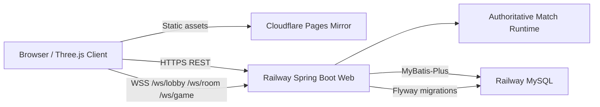
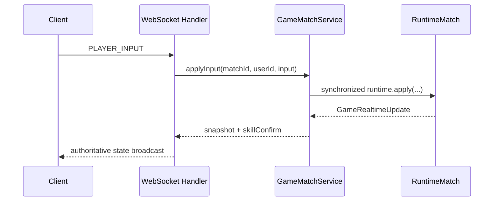

# WildHunt 荒野追猎

一款基于 Web 的多人非对称追猎游戏：狼在有限时间内识别并扑杀真人鹿，鹿则混入 AI 鹿群、维持状态、观察威胁，并用一次性的烟雾分身技能制造误导。


## 在线体验

- 推荐入口：<https://wildhunt-backend-production.up.railway.app>
- Cloudflare Pages 镜像：<https://wildhunt-fullstack.pages.dev>
- API 文档：<https://wildhunt-backend-production.up.railway.app/swagger-ui.html>
- GitHub：<https://github.com/typsusan-zzz/wildhunt-fullstack>

> 如果所在网络无法打开 `pages.dev`，请使用 Railway 推荐入口。推荐入口同时托管前端静态资源、REST API 和 WebSocket。

## 游戏截图

| 登录 | 大厅 | 对局 |
| --- | --- | --- |
|  |  |  |

## 玩法概览

WildHunt 的核心体验是“伪装、观察、判断和反判断”。

- 狼方目标：在倒计时结束前找出所有真人鹿。狼可以移动、嗅探、扑咬，但误判 AI 鹿或分身会浪费机会。
- 鹿方目标：混入鹿群并存活到时间结束。鹿可以进食维持饥饿值、环顾观察狼的位置，并在关键时刻使用烟雾分身。
- 烟雾分身：鹿每局只能使用一次。技能由后端权威确认，释放后原地生成烟雾和两只服务器同步的鹿分身。分身不是玩家、不计入胜负，狼扑中分身只会驱散它。
- 匹配与房间：支持游客登录、账号登录、自定义房间、房间聊天、好友邀请、快速匹配和正式对局恢复。
- 成长系统：包含赛季通行证、每日签到、活动奖励、排行榜和玩家资料。


## 技术架构





## 前端架构

- Vite + TypeScript 构建浏览器客户端。
- Three.js 负责 3D 场景、鹿群、狼、地形、自然物和烟雾 VFX。
- 输入层将移动、冲刺和一次性动作拆开处理；一次性动作使用序号保证 WebSocket 至少发送一次。
- 网络层通过 REST 处理登录、房间、匹配、奖励等业务，通过 WebSocket 接收正式对局快照。
- 生产构建可部署到 Cloudflare Pages，也可由 Spring Boot 后端同域名托管。

关键目录：

```text
frontend/src/api/       REST API client
frontend/src/net/       WebSocket client and protocol types
frontend/src/game/      3D game scene, input, network sync, VFX
frontend/public/        Public static assets
```

## 后端架构

- Spring Boot 3 + Java 17 提供 REST API 和 WebSocket。
- `wildhunt-web`：控制器、WebSocket handler、CORS、安全配置和应用入口。
- `wildhunt-service`：用户、好友、房间、匹配、对局、奖励、签到、活动等领域逻辑。
- `wildhunt-dal`：MyBatis-Plus 实体、Mapper 和数据库访问。
- `wildhunt-common`：通用 API 响应、工具和共享模型。
- MySQL 使用 Flyway 迁移维护 schema；本地无 MySQL 时，部分服务保留内存兜底以便开发和测试。

关键目录：

```text
backend/wildhunt-web/
backend/wildhunt-service/
backend/wildhunt-dal/
backend/wildhunt-common/
backend/wildhunt-web/src/main/resources/db/migration/
```

## 本地开发

要求：

- Node.js 22+
- JDK 17
- Maven 3.9+
- MySQL 8+

前端：

```powershell
cd frontend
npm install
$env:VITE_API_BASE_URL = "http://localhost:8080"
$env:VITE_WS_BASE_URL = "ws://localhost:8080"
npm run dev
```

后端：

```powershell
cd backend
$env:JAVA_HOME = "<path-to-jdk-17>"
$env:MYSQL_URL = "jdbc:mysql://localhost:3306/wildhunt?useUnicode=true&characterEncoding=utf8&serverTimezone=Asia/Shanghai&useSSL=false&allowPublicKeyRetrieval=true"
$env:MYSQL_USERNAME = "root"
$env:MYSQL_PASSWORD = "<local-mysql-password>"
$env:WILDHUNT_JWT_SECRET = "replace-with-a-local-secret"
$env:SPRING_FLYWAY_ENABLED = "true"
mvn test
mvn package
```

## 部署说明

生产环境当前使用：

- Railway：Spring Boot 后端、WebSocket、MySQL、同域名前端静态资源。
- Cloudflare Pages：前端镜像。

后端需要的环境变量：

```env
MYSQL_URL=jdbc:mysql://<host>:<port>/<database>?useUnicode=true&characterEncoding=utf8&serverTimezone=Asia/Shanghai&useSSL=false&allowPublicKeyRetrieval=true
MYSQL_USERNAME=<mysql-user>
MYSQL_PASSWORD=<mysql-password>
SPRING_FLYWAY_ENABLED=true
SPRING_PROFILES_ACTIVE=prod
WILDHUNT_JWT_SECRET=<long-random-secret>
PORT=<provided-by-platform>
```

前端独立部署时需要的构建变量：

```env
VITE_API_BASE_URL=https://wildhunt-backend-production.up.railway.app
VITE_WS_BASE_URL=wss://wildhunt-backend-production.up.railway.app
```

## 安全

- 不提交 `.env`、数据库密码、JWT 密钥、Cloudflare token、Railway token 或 GitHub token。
- 生产密钥只配置在托管平台的环境变量或 Secrets 中。
- WebSocket 握手会校验 JWT；房间、队伍和对局消息按授权范围广播。
- 正式对局状态以后端快照为准，关键动作和结算逻辑在后端做并发保护。

## 验证

```powershell
cd backend
mvn test package

cd ../frontend
npm run build
```

当前线上验证点：

- `/api/health` 返回 `UP`
- 游客登录可写入 MySQL 并返回 token
- `/ws/lobby` 可以建立 WebSocket 连接
- 根地址 `/` 返回前端页面
